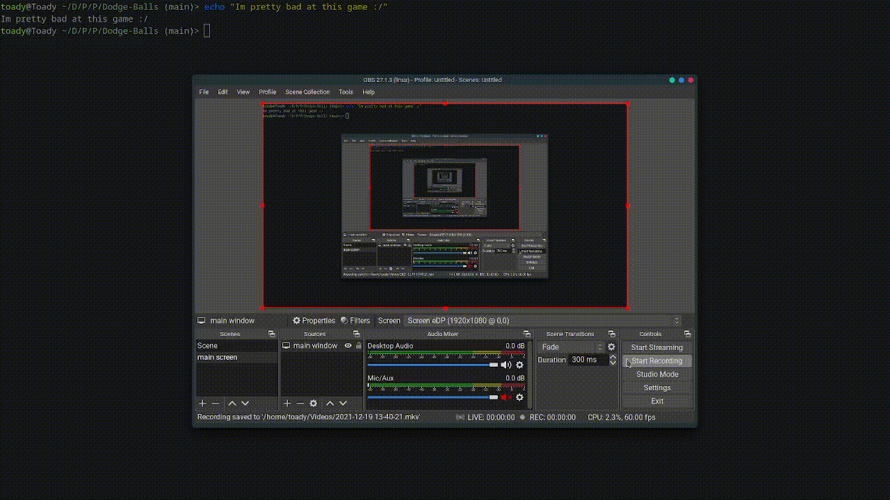

# Dodge-Balls

## About

This is a dodge ball game where the objective is to dodge the balls that move towards the player as best as possible
The player is the lone ball that is controlled by the mouse and is the same colour as the enemies adding to the challenge curve

## Controls and Objectives

1. The player follows the mouse
2. Enemies move towards the player
3. The player must dodge the enemies as best as possible

## Installation

1. do `$ git clone https://github.com/Reverend-Toady/Dodge-Balls.git` if you have git installed
2. download the zip files if you don't have git installed

## Usage

1. run `$ ./output/main` from the `dodge-balls` directory

## TODO

1. Add points
2. Display text "you lose" when player touches enemy (currently window closes)
3. Add replay option
